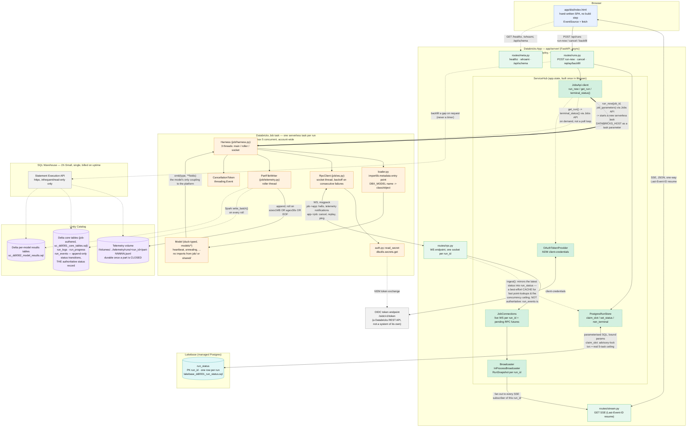
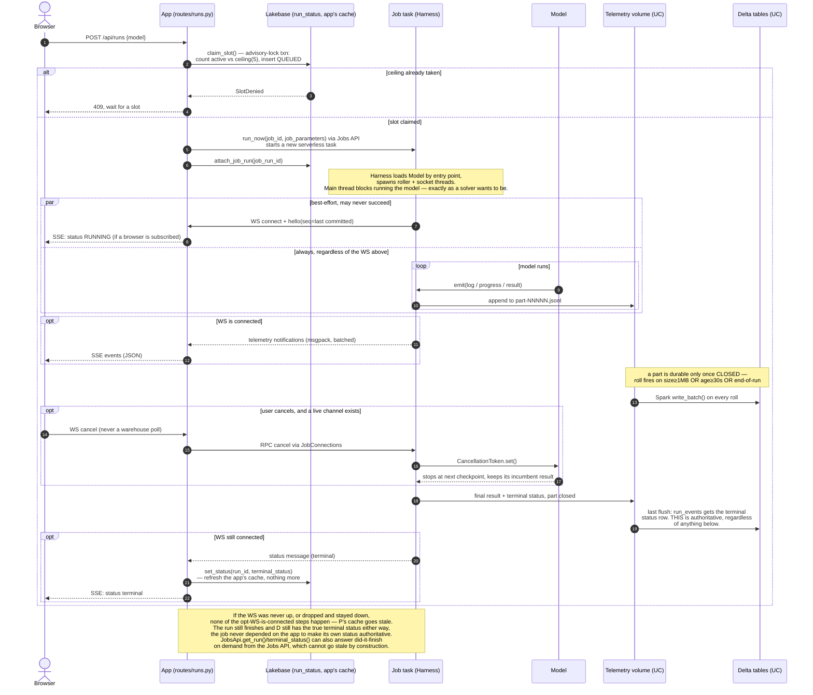

# Architecture diagrams

Visual companion to `docs/architecture.md` and `docs/message-envelope-spec.md`
— those two remain the source of truth for *why*; this file is *what talks to
what*, drawn from the actual code (`app/server/`, `job/`, `shared/`) rather
than from the target layout in `CLAUDE.md`. If a box or arrow here disagrees
with either of those, they win — file an update here.

Solid arrows are the **live** path (best-effort, may be down for hours at a
time). Dashed arrows are the **durable** path (Delta, always runs) or an
infrequent/on-demand call. Dotted arrows are control-plane calls (triggering
or querying a job run, not part of either transport tier).

## Component / data-flow diagram

Reading it:

- **Only two arrows cross the App/Job boundary while a run is live**: the WS
  (bidirectional, both directions best-effort) and the Delta write (one-way,
  never best-effort). Everything else in the `App` box is internal wiring.
- **The SQL warehouse touches nothing on the live path** — its only edges are
  dashed and originate from an explicit user action (backfill a gap), never a
  timer. That absence is the point of `docs/architecture.md`'s warehouse
  section, not an omission.
- **`ServiceHub` is composition, not a data path** — it's drawn as a nested
  box because every one of `Broadcaster`, `JobConnections`, `PostgresRunStore`,
  `JobsApi` and `OAuthTokenProvider` is built once in `lifespan` and reached by
  the routes via `Depends`, never imported at module scope.
- **A model (`models/*`) has exactly one edge on this whole diagram**: `emit()`
  into the harness. It never appears connected to `UC`, `Lakebase`, or any
  transport — that's `job/loader.py` discovering it by entry point, not by
  inheritance.
- **The job → app WS is one connection carrying two directions of traffic**:
  telemetry notifications flow job→app continuously; `cancel`/`replay`/`ping`
  requests flow app→job on the same socket, answered by
  `JobConnections`'s pending-future bookkeeping.
- **`run_events` (Delta, job-authored) is authoritative for status — `run_status`
  (Lakebase) is not.** The job writes every status transition into `run_events`
  through the same unconditional telemetry path as everything else
  (`PartWriter` → `Spark write_batch()`), whether or not the app is listening.
  `run_status` only exists because `run_events` is the wrong *shape* for what
  the app needs live — a point lookup by `run_id` and an atomic
  count-and-claim against the 5-task ceiling — so the app keeps its own
  one-row-per-run mirror, best-effort, updated when a WS status message
  happens to arrive. The job has no Postgres/Lakebase code at all
  (`app/shared/tables.py` says this outright); it never writes that mirror.
- **The Jobs API and the OIDC token endpoint aren't drawn as boxes.** Both are
  plain Databricks REST calls the app happens to make (`run_now`/`get_run`,
  and the M2M token exchange) — treating them as their own "control plane"
  system implied a component that isn't there. The diagram shows their effect
  directly: `run_now` starts the task, `get_run`/`terminal_status()` answers a
  question about it, and the OIDC edge is just how a token gets minted.

## Run lifecycle (sequence)

The same system, as one run's timeline — including the case that matters
most for this platform's cost model: **the app is not watching**.

Reading it:

- Everything inside the `par` block's second branch (model → job → volume →
  Delta) happens **unconditionally**. The WS branch alongside it is drawn as
  `par`, not `then`, on purpose — it is not a step the durable path waits for
  or depends on.
- The cancel step is the concrete shape of "cancel goes through the app,
  never a warehouse poll" (`docs/architecture.md`): the client's only inbound
  channel is the WS, and if it isn't up, there is currently no live cancel
  path — the escape hatch is a direct `databricks jobs cancel-run`
  (`app/server/jobs_api.py`'s `CANCEL_ESCAPE_HATCH` reference), not a warehouse
  flag a poller would pick up.
- `run_now` is drawn straight from the app to the job task: the Jobs API is
  the mechanism by which Databricks starts that task, not a separate system
  worth its own lane on this diagram.
- The terminal `set_status()` call into `P` (Lakebase) is labelled as a cache
  refresh, not a source of truth — because it isn't one. The job's own write
  into `D`'s `run_events`, one step earlier, is what makes the terminal status
  real; it happens whether or not the app, the WS, or Lakebase are anywhere
  in the picture.
- The final note is deliberately hedged: `JobsApi.get_run()` and
  `terminal_status()` exist and can answer "did this finish?" for a
  `job_run_id` on demand, but as of this writing `app/server/main.py`'s
  `lifespan` does **not** call them automatically at startup to reconcile
  stale `run_status` rows — an earlier warehouse-based reconciliation step was
  removed and nothing has replaced it yet. Don't read this diagram as saying
  otherwise; check `app/server/main.py` and `app/server/services.py` before
  relying on automatic reconciliation existing.

## Where this stands relative to `CLAUDE.md`

Both diagrams reflect **built** code (`app/server/`, `job/`, `shared/`,
`models/heartbeat`, `models/annealing`) on `v4-plan`, not the eleven-model
target state `CLAUDE.md` describes. The other ten models, the volume→SQL
ingestion job (Slice 4), and automatic startup reconciliation are not drawn
here because they don't exist yet — see `CLAUDE.md`'s "Still not done" list.
