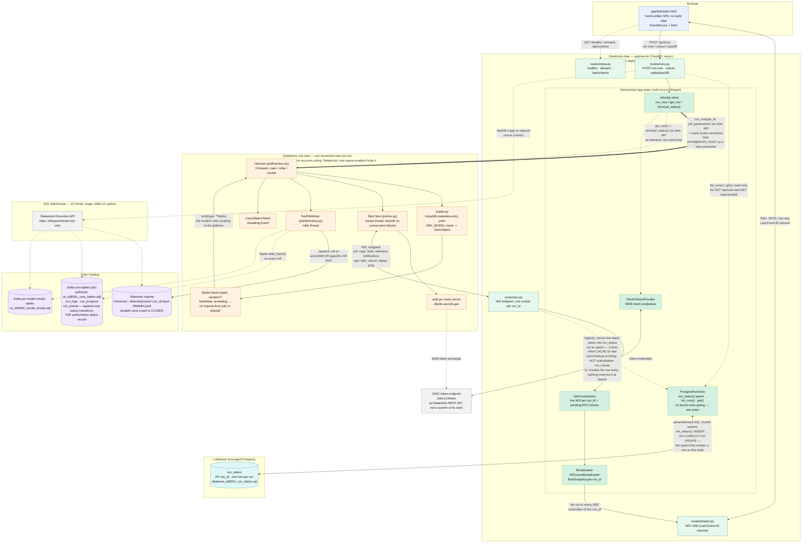
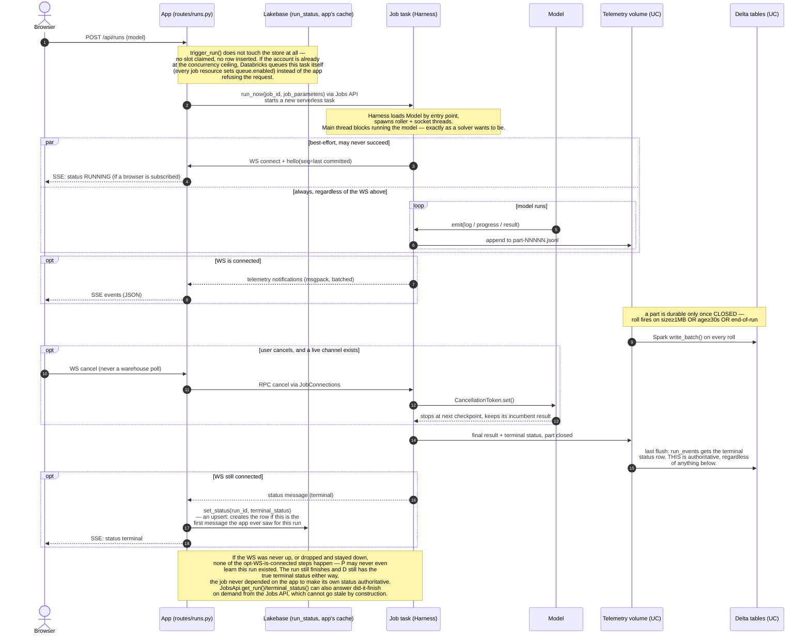
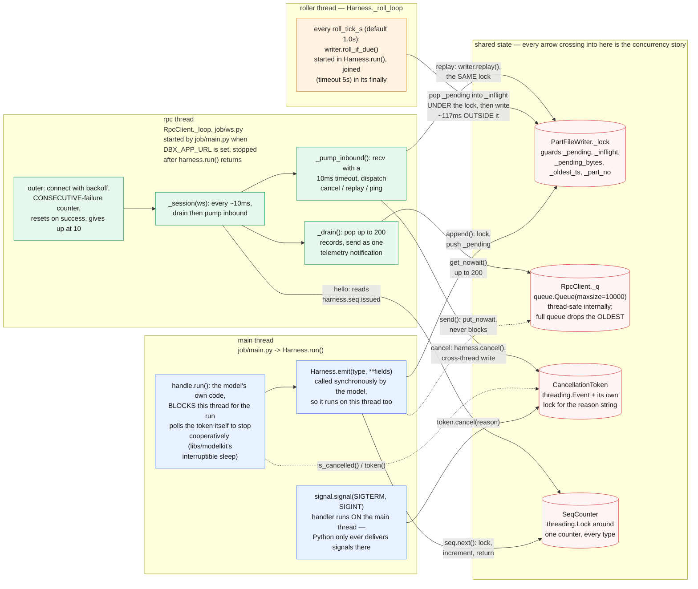
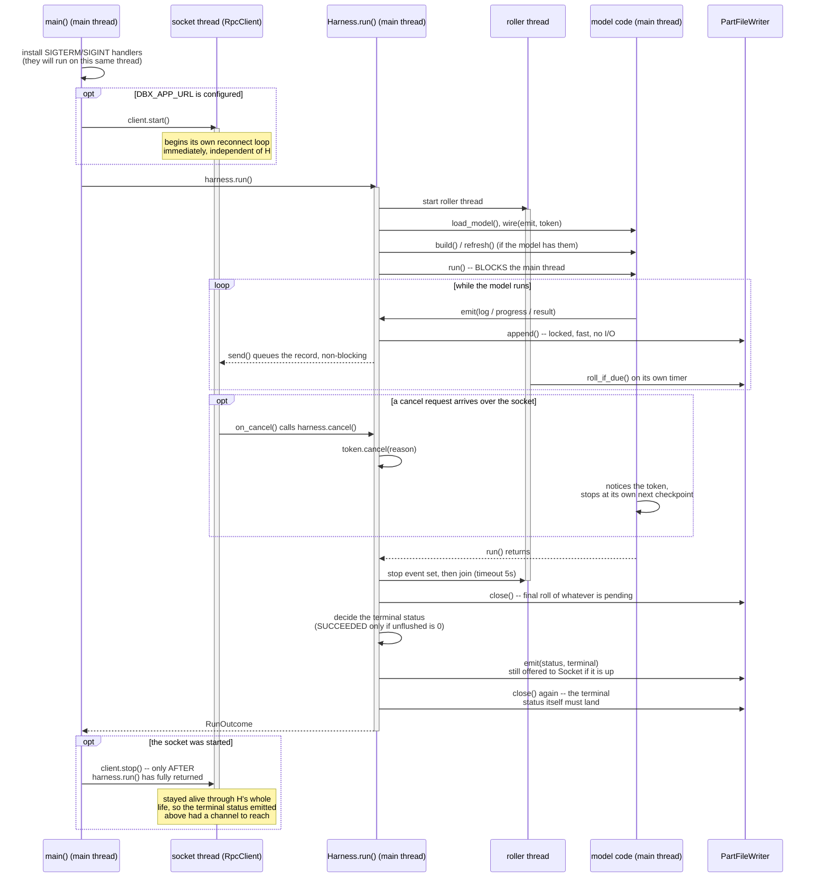
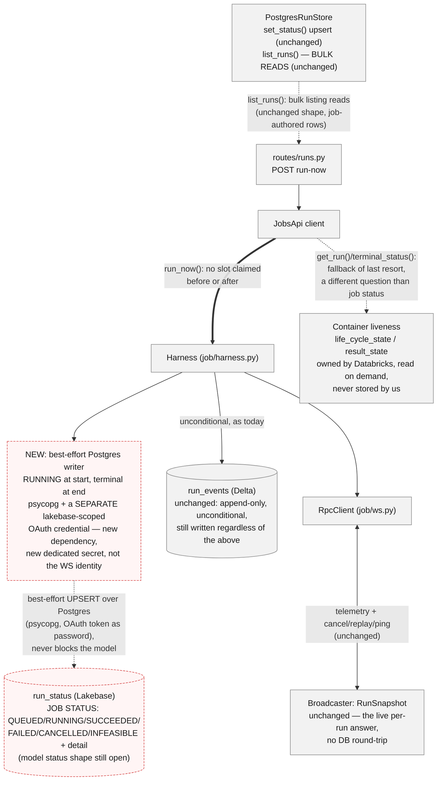

# Architecture diagrams

Visual companion to `docs/architecture.md` and `docs/message-envelope-spec.md`
— those two remain the source of truth for *why*; this file is *what talks to
what*, drawn from the actual code (`app/server/`, `job/`, `shared/`) rather
than from the target layout in `CLAUDE.md`. If a box or arrow here disagrees
with either of those, they win — file an update here.

Solid arrows are the **live** path (best-effort, may be down for hours at a
time). Dashed arrows are the **durable** path (Delta, always runs) or an
infrequent/on-demand call. Dotted arrows are control-plane calls (triggering
or querying a job run, not part of either transport tier).

## Component / data-flow diagram

Reading it:

- **Only two arrows cross the App/Job boundary while a run is live**: the WS
  (bidirectional, both directions best-effort) and the Delta write (one-way,
  never best-effort). Everything else in the `App` box is internal wiring.
- **The SQL warehouse touches nothing on the live path** — its only edges are
  dashed and originate from an explicit user action (backfill a gap), never a
  timer. That absence is the point of `docs/architecture.md`'s warehouse
  section, not an omission.
- **`ServiceHub` is composition, not a data path** — it's drawn as a nested
  box because every one of `Broadcaster`, `JobConnections`, `PostgresRunStore`,
  `JobsApi` and `OAuthTokenProvider` is built once in `lifespan` and reached by
  the routes via `Depends`, never imported at module scope.
- **A model (`models/*`) has exactly one edge on this whole diagram**: `emit()`
  into the harness. It never appears connected to `UC`, `Lakebase`, or any
  transport — that's `job/loader.py` discovering it by entry point, not by
  inheritance.
- **The job → app WS is one connection carrying two directions of traffic**:
  telemetry notifications flow job→app continuously; `cancel`/`replay`/`ping`
  requests flow app→job on the same socket, answered by
  `JobConnections`'s pending-future bookkeeping.
- **`run_events` (Delta, job-authored) is authoritative for status — `run_status`
  (Lakebase) is not.** The job writes every status transition into `run_events`
  through the same unconditional telemetry path as everything else
  (`PartWriter` → `Spark write_batch()`), whether or not the app is listening.
  `run_status` only exists because `run_events` is the wrong *shape* for what
  the app needs live — a point lookup by `run_id` for listing and reading runs
  — so the app keeps its own one-row-per-run mirror, best-effort, updated when
  a WS status message happens to arrive. The job has no Postgres/Lakebase code
  at all (`app/shared/tables.py` says this outright); it never writes that
  mirror.
- **Nothing on this diagram enforces the account's 5-concurrent-task ceiling
  — and that's correct, not an omission.** An earlier design had
  `PostgresRunStore.claim_slot()` do an atomic count-and-claim before every
  launch; it is dead code today (nothing calls it — confirmed by grep, and
  `routes/runs.py::trigger_run()`'s own docstring says so: *"this is the
  change from v3... The ceiling still holds; Databricks holds it. Every job
  file sets `queue.enabled`, so a sixth concurrent task waits instead of
  failing."*). Every `resources/*.job.yml` does set `queue: enabled`. See
  `docs/v4-rewrite-plan.md`'s "Run state: the job writes it, and there are two
  kinds" for the fuller reasoning this retired.
- **The Jobs API and the OIDC token endpoint aren't drawn as boxes.** Both are
  plain Databricks REST calls the app happens to make (`run_now`/`get_run`,
  and the M2M token exchange) — treating them as their own "control plane"
  system implied a component that isn't there. The diagram shows their effect
  directly: `run_now` starts the task, `get_run`/`terminal_status()` answers a
  question about it, and the OIDC edge is just how a token gets minted.

## Run lifecycle (sequence)

The same system, as one run's timeline — including the case that matters
most for this platform's cost model: **the app is not watching**.

Reading it:

- Everything inside the `par` block's second branch (model → job → volume →
  Delta) happens **unconditionally**. The WS branch alongside it is drawn as
  `par`, not `then`, on purpose — it is not a step the durable path waits for
  or depends on.
- The cancel step is the concrete shape of "cancel goes through the app,
  never a warehouse poll" (`docs/architecture.md`): the client's only inbound
  channel is the WS, and if it isn't up, there is currently no live cancel
  path — the escape hatch is a direct `databricks jobs cancel-run`
  (`app/server/jobs_api.py`'s `CANCEL_ESCAPE_HATCH` reference), not a warehouse
  flag a poller would pick up.
- `run_now` is drawn straight from the app to the job task: the Jobs API is
  the mechanism by which Databricks starts that task, not a separate system
  worth its own lane on this diagram.
- **There used to be a `claim_slot()`/`SlotDenied` step here, and it's gone
  because it was never actually called.** `routes/runs.py::trigger_run()`
  launches a run without touching the store at all — confirmed by grep,
  nothing in `app/server/` calls `claim_slot()`, `attach_job_run()`, or
  `release_slot()`. Its docstring says this is deliberate: a scheduled run
  never passes through the app, so a ceiling checked only on this one route
  was already counting the wrong number, and every job resource's
  `queue.enabled` makes Databricks itself the thing that queues a run past
  the account ceiling. `docs/v4-rewrite-plan.md` has the fuller argument.
- The terminal `set_status()` call into `P` (Lakebase) is labelled as a cache
  refresh, not a source of truth — because it isn't one. The job's own write
  into `D`'s `run_events`, one step earlier, is what makes the terminal status
  real; it happens whether or not the app, the WS, or Lakebase are anywhere
  in the picture. One consequence worth knowing: since nothing calls
  `attach_job_run()` any more, `run_status.job_run_id` is never populated —
  the column exists but nothing currently writes it.
- The final note is deliberately hedged: `JobsApi.get_run()` and
  `terminal_status()` exist and can answer "did this finish?" for a
  `job_run_id` on demand, but as of this writing `app/server/main.py`'s
  `lifespan` does **not** call them automatically at startup to reconcile
  stale `run_status` rows — an earlier warehouse-based reconciliation step was
  removed and nothing has replaced it yet. Don't read this diagram as saying
  otherwise; check `app/server/main.py` and `app/server/services.py` before
  relying on automatic reconciliation existing.

## Job concurrency model (threads)

Zooming into one box from the diagrams above: `job/harness.py`'s own
docstring says *"three threads, and that is the whole concurrency story
[...] they meet at two places only: a `queue.Queue` of outbound frames, and
the `CancellationToken`."* That undercounts by two — `PartFileWriter._lock`
(`job/telemetry.py`) and `SeqCounter`'s own lock (`shared/seq.py`, and
`shared/seq.py` says so explicitly: *"Thread-safe. The model's callback
fires on a worker thread [...] Both draw from here, so the lock is not
optional"*) are just as real a meeting point. Worth naming rather than
silently correcting, in the spirit of the rest of this file: a docstring
describing "the whole concurrency story" is exactly the kind of claim that
goes stale quietly.

Reading it:

- **The model and the harness share a thread, by design.** `Harness.emit()`
  is not a message passed to another thread — the model calls it directly,
  synchronously, so `append()` and `send()` execute on the same thread the
  solver is blocking. This is why `append()` has to be fast and lock-scoped
  tightly: it is on the critical path of whatever the model is doing, not a
  background concern.
- **`PartFileWriter._lock` is held by three different threads for three
  different reasons** — main (`append()`, and `close()` at both ends of a
  run), roller (`roll_if_due()` on a timer), and the socket thread
  (`replay()`, answering a gap-fill request from the app). The lock is
  narrow on purpose: the ~117ms file write in `_roll()` happens **outside**
  it, which is what stops a slow volume write from blocking the model's own
  `append()` calls.
- **The outbound queue is the only place backpressure is allowed to show
  up, and it shows up as data loss, not blocking.** `RpcClient.send()` never
  blocks and never raises — a full queue drops the OLDEST record rather
  than refusing the model's newest one. That is a deliberate trade
  (recent telemetry over old, when a viewer is actually watching), not an
  accident of using a bounded queue: the volume already has everything, so
  nothing durable is actually lost.
- **The `CancellationToken` is written from two different threads and read
  from a third.** The socket thread writes it when a `cancel` RPC arrives;
  the main thread's own signal handler writes it on SIGTERM/SIGINT
  (Python delivers signals to the main thread only, which is why this isn't
  a fourth thread); the model, running on the main thread, reads it to
  decide whether to keep going. All three go through the token's own lock,
  not a new one.
- **`SeqCounter` is the quietest cross-thread dependency here**, and the
  easiest to miss: the socket thread reads `harness.seq.issued` once per
  reconnect (to say "resume from here" in `hello`), while the main thread
  is continuously incrementing the same counter inside `emit()`. Nothing
  about the harness's own "two places only" framing mentions this at all.

### Startup and shutdown order

The interesting bugs in a threaded harness are almost always about *order*,
not logic — what's guaranteed to have started before what, and what's
guaranteed to still be alive when something else finishes. This is what
`job/main.py` and `job/harness.py` actually guarantee:

Reading it:

- **The socket outlives `harness.run()` on purpose.** `client.stop()` is
  called in `job/main.py` only *after* `harness.run()` returns — so the
  terminal status message, emitted inside `Harness._finalise()`, still has
  a live channel to be offered to if one was ever connected. Stopping the
  socket before that emit would silently turn every run's last, most
  important message into an unobserved one.
- **The roller stops before `_finalise()` runs, not after.** `Harness.run()`
  sets `_stop_roller` and joins the roller thread (timeout 5s) in its
  `finally`, before deciding the terminal status. This matters because
  `_finalise()` calls `writer.close()` itself — if the roller were still
  ticking, two threads could both try to roll the same pending batch at
  once. By the time `_finalise()` runs, there is exactly one thread left
  touching the writer.
- **A cancel doesn't stop anything by itself — it's cooperative.** Setting
  the token doesn't interrupt `handle.run()`; the model has to be polling
  it (which is what `libs/modelkit`'s interruptible sleep is for). A model
  that never checks the token runs to completion regardless of how many
  times `cancel()` is called — the token changes what the model *sees*, not
  what the CPU is doing.
- **Two `writer.close()` calls at the end are deliberate, not a bug.** The
  first flushes whatever the model left pending before the terminal status
  is decided (so `unflushed` is accurate); the second is needed because
  emitting that terminal status itself adds one more record to `_pending` —
  without the second `close()`, the very message announcing SUCCEEDED could
  be the one record that never reaches the volume.

## Proposed: job-authored `run_status`, over the Lakebase Data API (not yet built)

Everything above is the shipped design: the app writes `run_status` from a
WS status message it happens to receive (`services.py::_persist_status`),
and `job/` has no Postgres code at all. This section is a **proposal**,
kept deliberately separate from the two diagrams above so neither one
misrepresents what's actually running on `v4-plan` today.

**This isn't a new idea — it's already the decision record.**
`docs/v4-rewrite-plan.md`'s "Run state: the job writes it, and there are two
kinds" section worked this out on 2026-08-30: *"A scheduled run never
touches the app, so the app cannot be the writer of run state — it would be
absent for exactly the runs that most need recording... The job maintains
run state in Lakebase, and keeps it current."* What follows restates that
plan against the diagrams above.

**Correction, 2026-09-18: this section previously claimed a "Lakebase Data
API" — a PostgREST-compatible REST interface needing no Postgres driver and
no new credential. That was wrong, and it was wrong in this session, not
inherited from an old branch.** `docs/dbx_external-apps-manual-api.md`
describes only a REST flow for *issuing a database credential*; reading or
writing a row still goes over the Postgres wire protocol. There is no
table-level REST CRUD endpoint. The mechanism below is corrected to match
what's actually confirmed: a real Postgres connection, authenticated with an
OAuth token, exactly what `app/server/store.py` and `app/server/oauth.py`
already do for the app today.

### Three status concepts, not two

The plan doc's own table is the clearer cut than a Databricks-vs-ours split:

| | Job status | Model status |
|---|---|---|
| What it is | The platform lifecycle: `QUEUED`/`RUNNING`/`SUCCEEDED`/`FAILED`/`CANCELLED`/`INFEASIBLE` + `detail` | Where *this particular model* thinks it is — its own categorical stages |
| Defined by | The platform. Fixed, small, shared by every model | The model. Varies per model by design |
| Wire shape today | `shared/envelope.py`'s `status: RunStatus` | Still open — see below |

...and a third question that neither row answers, because it isn't about
`run_status` at all: **"is the container still alive?"** — that's
`life_cycle_state`/`result_state`, Databricks' own concept, needing no write
from us, read straight from `GET /api/2.2/jobs/runs/get`
(`JobsApi.get_run()`) whenever it's actually asked. The plan doc states the
three-way split on "reading it back" directly: *"Is it running? → the Jobs
API. Not a table, not a count... What is it doing right now? → the app's
in-memory cache, fed by the live stream... What has it been doing? →
Postgres."*

`INFEASIBLE` is the sharpest illustration of why *job status* has to be
harness-authored: a Gurobi task can exit with Databricks
`result_state=SUCCESS` — the container ran fine — while the model concluded
there's no feasible solution, a fact Databricks has no vocabulary for at
all. Only the harness can produce that value.

**Narrowed, not fully closed:** the plan doc left "where does *model*
status live on the wire" explicitly open. It's narrowed now — model status
is tracked in Lakebase, not left to ride `progress.payload` alone — but the
exact shape (a `model_status` column? a separate table?) is still
undecided. Don't read this section as having settled that part.

### What changes

- **The launch path is untouched, because it never gated anything to
  begin with.** `routes/runs.py::trigger_run()` calls `run_now()` directly
  and touches no store at all — there is no slot to stop reserving. If the
  account is genuinely at its concurrency ceiling, Databricks' own
  `queue.enabled` (set on every job resource) queues the excess task; this
  proposal doesn't add or remove anything on that path.
- **The harness becomes the sole writer of *job status* after `QUEUED`.**
  `RUNNING` on startup and the terminal status at the end get written into
  Lakebase's `run_status` directly, alongside the existing unconditional
  write into Delta's `run_events` — not instead of it.
- **The mechanism is a real Postgres connection, authenticated with an OAuth
  token as the password** — `psycopg` (or an async equivalent), the same
  library and the same "token, not a static password" approach
  `app/server/store.py::PostgresRunStore._conn()` already uses for the app.
  **Confirmed 2026-09-18** against a real workspace, from a notebook using
  M2M client credentials to read a Lakebase table — so the mechanism itself
  is settled, not proposed.
- **It needs a new dependency in the job (a Postgres driver) and a second,
  dedicated credential — not the WS ingress identity reused.** There are two
  separate service-principal identities in play: whatever "normal" OAuth
  client id/secret the job already presents to the app's WS ingress, and a
  **separate `lakebase`-specific client id/secret**, granted its own Postgres
  role on `dbx_leaning.run_status` (`databricks_create_role(...)` in the
  Lakebase SQL editor, per `docs/dbx_external-apps-manual-api.md`'s
  prerequisites table). Job config needs a second scope/key-name triple —
  mirroring `DBX_OAUTH_SECRET_SCOPE`/`_CLIENT_ID_KEY`/`_SECRET_KEY` but
  distinct from them, e.g. `DBX_LAKEBASE_OAUTH_SECRET_SCOPE` and friends —
  not a reuse of the existing three.
- **It has to be best-effort, never blocking the model** — the same
  contract `job/ws.py`'s socket thread already has. A Postgres write that
  fails, times out, or errors must not touch what the model reports or delay
  it. `run_events` remains the durable record regardless of whether this
  write lands; it is a better-shaped second mirror of the same fact, not a
  new source of truth.
- **The app stops writing `run_status` entirely.** `services.py::ingest()`
  drops its call to `store.set_status()` on a WS status message — two
  writers of one row was the thing worth removing.
- **Per-run live status still needs no Lakebase read.** `Broadcaster`'s
  `RunSnapshot` (`app/server/broadcaster.py`) already caches the latest
  status/progress per `run_id` in-process precisely so a newly-connecting
  SSE client doesn't need a DB round-trip — untouched, and it becomes the
  *only* live-status path, matching the plan doc's "the app's in-memory
  cache, fed by the live stream."
- **Lakebase reads are for bulk views only** — `list_runs()` in `store.py`
  is the one with a real caller today (`routes/runs.py`'s `GET /api/runs`);
  `non_terminal()` exists but nothing calls it yet, reserved for a
  reconciliation feature that was designed, then removed, and hasn't been
  rebuilt (`app/server/main.py`'s `lifespan` says so directly).
- **`JobsApi.get_run()`/`terminal_status()` answers a different question
  than *job status* entirely** — container liveness, not what the model
  concluded — and stays a fallback of last resort for the one case the
  harness itself can't cover: it died before writing anything anywhere at
  all (e.g. the `sys.exit(0)` failure mode `CLAUDE.md` already documents).

Red dashed nodes are new; grey ones are today's behaviour, unchanged.
Building this needs: a Postgres driver added to the job's dependency floor
(`job/requirements.txt`), a second, dedicated Lakebase OAuth credential
provisioned and granted its own Postgres role (distinct from the WS ingress
identity), and the harness's existing `M2MTokenProvider` pattern reused —
same shape, second instance, second secret. The mechanism is confirmed; the
wiring is not. None of this exists yet; treat this section as a design note,
not a changelog entry.

## Where this stands relative to `CLAUDE.md`

Both diagrams reflect **built** code (`app/server/`, `job/`, `shared/`,
`models/heartbeat`, `models/annealing`) on `v4-plan`, not the eleven-model
target state `CLAUDE.md` describes. The other ten models, the volume→SQL
ingestion job (Slice 4), and automatic startup reconciliation are not drawn
here because they don't exist yet — see `CLAUDE.md`'s "Still not done" list.
The proposed job-authored `run_status` design above is even earlier stage:
it has no code at all yet, on either side — though it isn't a new idea, it's
`docs/v4-rewrite-plan.md`'s own decision record, not yet built.

**Also worth naming: this file's earlier revisions got the ceiling wrong.**
Two prior versions of the diagrams here depicted `PostgresRunStore.claim_slot()`
and `SlotDenied` as live behaviour, and the first proposal drafted here assumed
the app still needed to "claim a slot" at launch. Neither was true — that
machinery is dead code today, and `docs/v4-rewrite-plan.md` had already
retired it in the plan on 2026-08-30. Kept here as a reminder that this file
is drawn from the code and the plan record, not re-derived from first
principles each time.

**A second one, same lesson: the proposed section above named a "Lakebase
Data API" that doesn't exist as described**, and called it settled
("no new dependency, no new credential type") without it having been tried.
It took a real notebook test and a closer read of
`docs/dbx_external-apps-manual-api.md` to catch — see that section's
2026-09-18 correction. The mechanism is a Postgres connection with an OAuth
token as the password, over a second, dedicated credential, not a REST data
API over the WS ingress identity.
